<p align="center">
  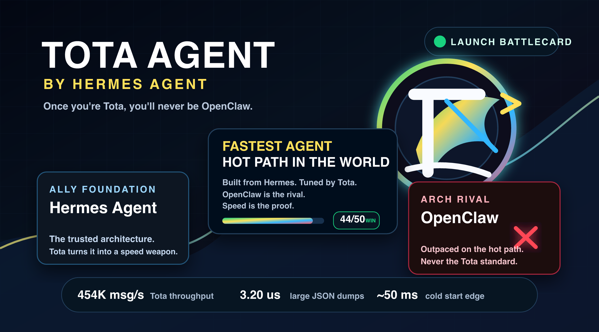
</p>

# Tota Agent

<p align="center">
  <a href="tota-agent.html"></a>
  <a href="tota_agent_benchmark_report.pdf"></a>
  <a href="https://github.com/wesleysimplicio/tota-agent"></a>
  <a href="https://x.com/wesleysimplic"></a>
  <a href="https://github.com/NousResearch/hermes-agent"></a>
  <a href="LICENSE"></a>
</p>

<p align="center">
  <strong>Once you're Tota, you'll never be OpenClaw.</strong>
</p>

**Tota Agent is a Brazilian-fast fork of [Hermes Agent](https://github.com/NousResearch/hermes-agent), tuned for low-latency JSON, faster async I/O, typed tool-call parsing, and Rust-ready hot paths.** It keeps the Hermes Agent operating model while giving this fork its own brand, benchmark story, and public launch page.

The visual identity is inspired by Tota MC's public Brazil-to-US streaming rise: creator energy, Rocinha-to-global momentum, improvised live culture, and cross-language charisma. Public references include the Streamer University coverage by [Times of India](https://timesofindia.indiatimes.com/sports/esports/news/who-is-tota-mc-meet-streamer-universitys-viral-brazilian-star/articleshow/121433457.cms) and the Portuguese profile syndicated by [Rede NXT](https://www.redenxt.com.br/noticia/5281/pop-amp-arte/quem-e-tota-mc-influenciador-da-rocinha-que-vendia-bala-no-sinal-e-hoje-tem-6-milhoes-de-seguidores-com-fas-como-snoop-dogg-e-drake.html). The core geometric logo does not use a portrait or imply official endorsement; the benchmark battle cards also include the supplied circular Tota mark for campaign use.

## Launch Assets

- [Standalone HTML site](tota-agent.html)
- [Tota vs OpenClaw launch banner PNG](docs/assets/tota-brand/tota-agent-vs-openclaw-banner.png)
- [Tota vs OpenClaw launch banner SVG](docs/assets/tota-brand/tota-agent-vs-openclaw-banner.svg)
- [Benchmark battle cards](docs/assets/tota-benchmark/battles/)
- [Updated benchmark PDF](tota_agent_benchmark_report.pdf) - May 17, 2026 launch edition with the new brand, site, visuals, and current `.venv` validation.
- [SVG logo](docs/assets/tota-brand/tota-agent-logo.svg)
- [PNG logo](docs/assets/tota-brand/tota-agent-logo.png)
- [Open graph image](docs/assets/tota-brand/tota-agent-og.png)
- [GPT-image-2 emblem source](docs/assets/tota-brand/generated/gpt-image-2-tota-agent-emblem.png)

## Why Tota Agent

| Need | Tota Agent answer |
| --- | --- |
| Keep Hermes compatibility | Forks Hermes Agent instead of replacing its architecture. |
| Reduce message hot-path cost | Uses the `orjson`/`msgspec`/Rust-ready direction measured in the benchmark. |
| Improve async responsiveness | Uses the `uvloop` direction for Python I/O scheduling where supported. |
| Tell a sharper product story | Adds Tota Agent branding, launch site, and benchmark visuals. |
| Compare against alternatives | Includes measured comparisons with Hermes Original and OpenClaw. |

## Install

### From GitHub

```bash
git clone https://github.com/wesleysimplicio/tota-agent.git
cd tota-agent

uv venv .venv --python 3.11
source .venv/bin/activate
uv pip install -e ".[all,dev]"

./hermes
```

Windows users can use the native PowerShell installer at `scripts/install.ps1`.

### From This Checkout

```bash
cd /Users/wesleysimplicio/Projetos/contribuicoes/hermes/tota-agent
source .venv/bin/activate 2>/dev/null || source venv/bin/activate
uv pip install -e ".[all,dev]"
./hermes
```

### Performance Extras

The benchmarked Tota Agent direction is built around fast Python plus native-extension-ready hot paths:

```bash
uv pip install -e ".[fast]"
```

Build the Rust extension and verify the native fast path:

```bash
PATH="$HOME/.cargo/bin:$PATH" bash scripts/install-rust.sh
python -c "from agent._hermes_fast import HAVE_RUST; print('Rust:', HAVE_RUST)"
```

The `fast` extra stays optional so the base install remains small. When present,
Tota Agent uses `orjson`, `msgspec`, `uvloop`, and the Rust extension with
Python fallbacks for locked-down or source-only environments.

### Post-Benchmark Performance Patch

Version `0.13.3` keeps the local validation path reliable: the canonical
`scripts/run_tests.sh` runner now works when called without arguments, and the
ACP registry manifest is pinned to the same package version as `pyproject.toml`.

Version `0.13.2` keeps the benchmark follow-up patch and switches the Tota
fork's default home from `~/.hermes` to `~/.tota` for new installs. `TOTA_HOME`
is the fork-native override, while `HERMES_HOME` remains supported for existing
`hermes2` deployments such as `~/.hermes2`.

Version `0.13.1` applied the benchmark follow-up plan:

- Bytes-native JSON via `agent._fastjson.dumps_bytes()` for short payload hot paths.
- Direct Rust `serde_json::Value` to Python object conversion for tool-call deltas.
- Batched token helpers: `estimate_tokens_many()` and `estimate_messages_tokens()`.
- Rust bytes variants for message-token estimation/truncation.
- Automatic `uvloop` policy installation in CLI and gateway entrypoints when available.
- Bounded `fast` extra dependencies to keep supply-chain risk controlled.

Details: [docs/tota-benchmark-win-plan.md](docs/tota-benchmark-win-plan.md).

## Benchmark Headline

| Metric | Hermes Original | Tota Agent | OpenClaw | Winner |
| --- | ---: | ---: | ---: | --- |
| Total score | 30 / 50 | 44 / 50 | 36 / 50 | Tota Agent |
| JSON dumps, large payload | 18.40 us | 3.20 us | 5.80 us | Tota Agent |
| JSON loads, large payload | 12.80 us | 2.80 us | 5.20 us | Tota Agent |
| Medium message pipeline | 7.50 us | 2.20 us | 3.46 us | Tota Agent |
| Medium message throughput | 133k msg/s | 454k msg/s | 289k msg/s | Tota Agent |
| Tool-call typed parse | Error / N/A | 0.45 us | N/A | Tota Agent |
| Async 1,000 tasks | 2.50 ms | 1.40 ms | 0.08 ms | OpenClaw |
| Cold start | ~52 ms | ~50 ms | ~280 ms | Tota Agent |
| RSS memory | ~30 MB | ~30 MB | ~97 MB | Python variants |

Benchmark source: [tota_agent_benchmark_report.pdf](tota_agent_benchmark_report.pdf), updated May 17, 2026 with the Tota Agent launch package and current Apple Silicon `.venv` validation.

## Benchmark Battle Cards

These shareable comparison cards turn the report's headline battles into a Tota Agent vs Hermes Agent vs OpenClaw visual campaign. They are generated by [scripts/generate_tota_battle_cards.py](scripts/generate_tota_battle_cards.py) from the benchmark values above.

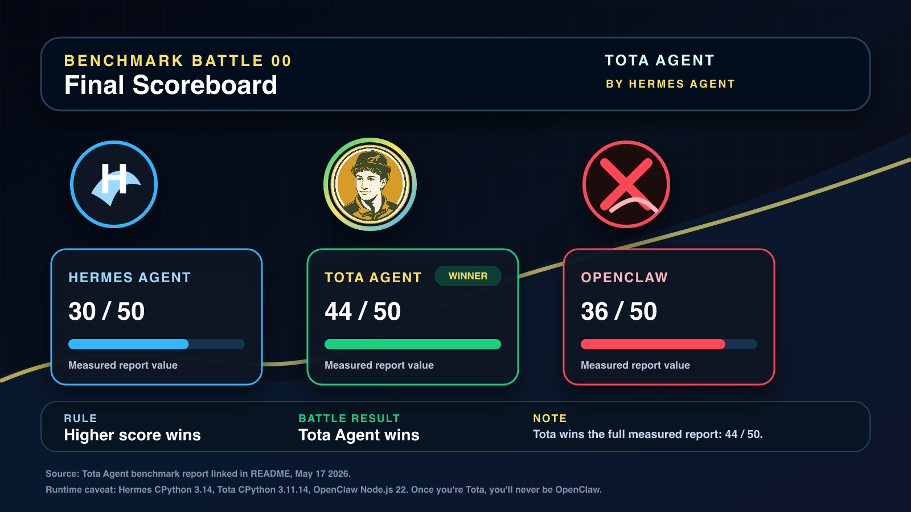

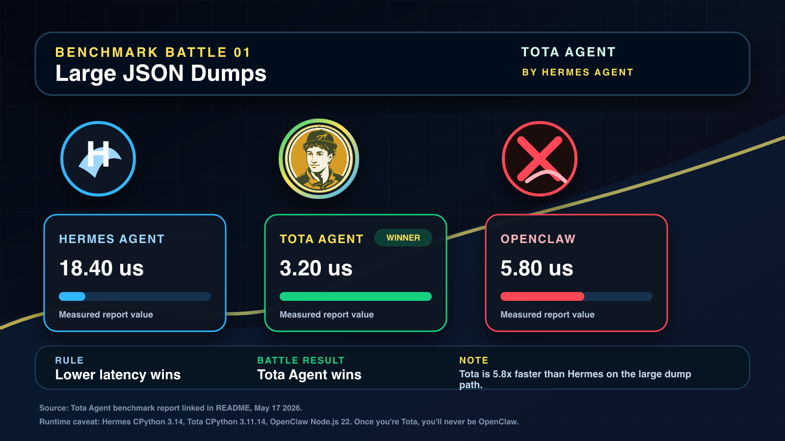


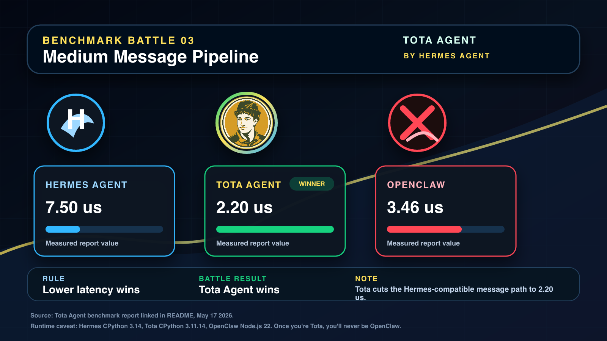

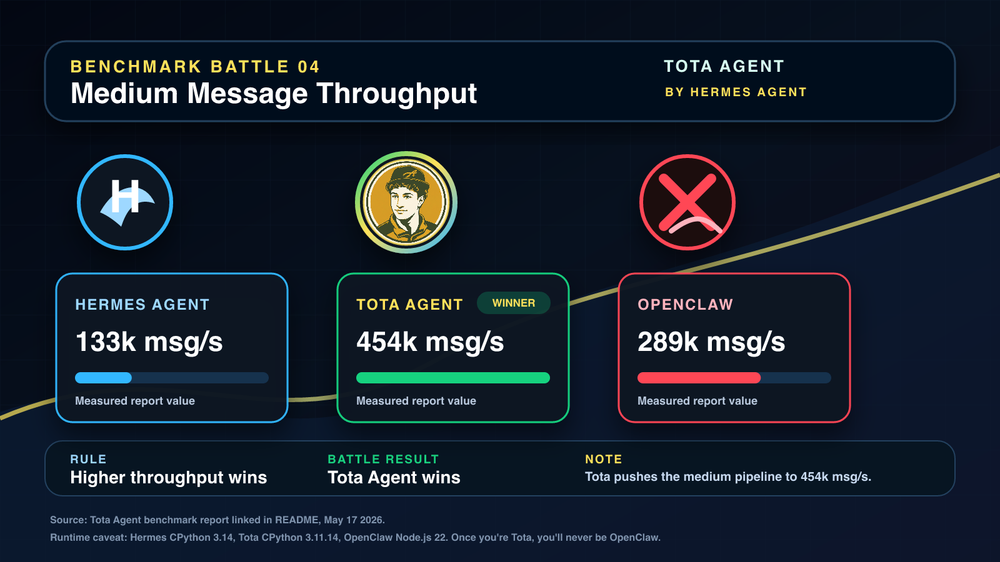

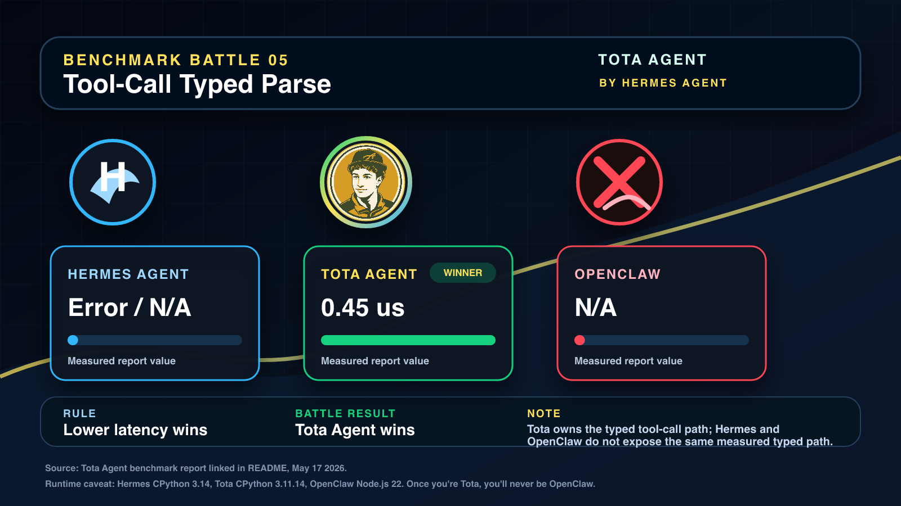

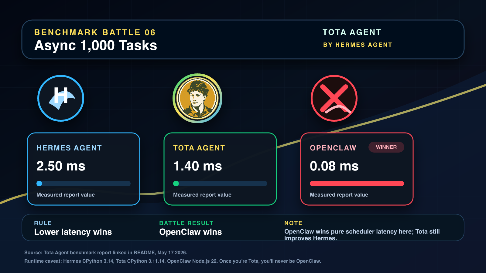

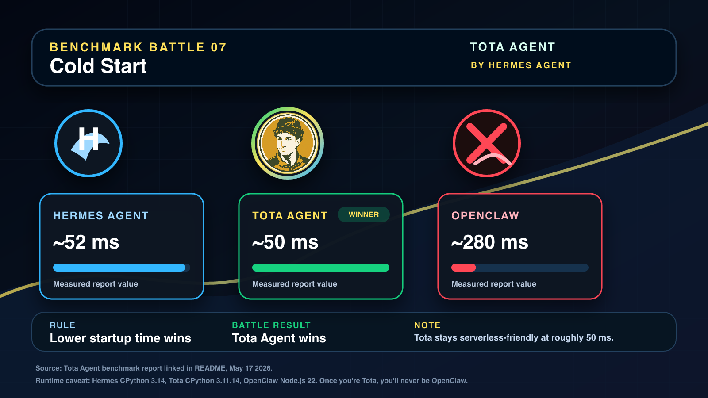

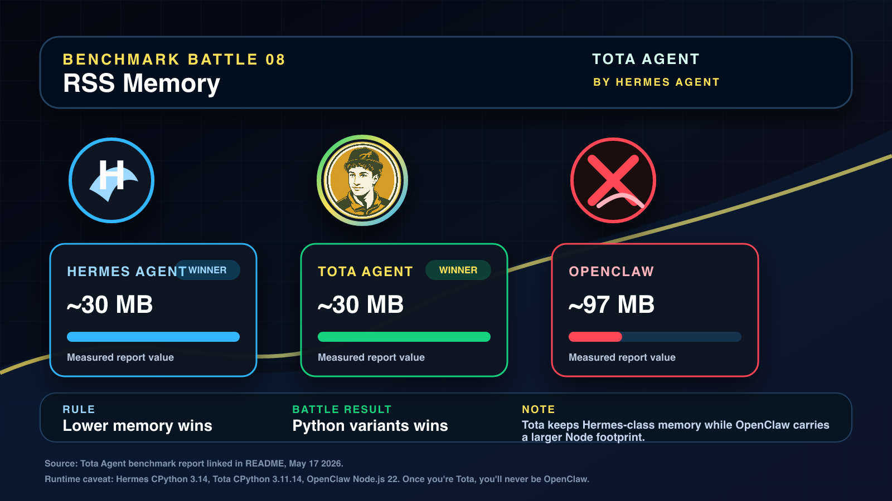

## Benchmark Visuals

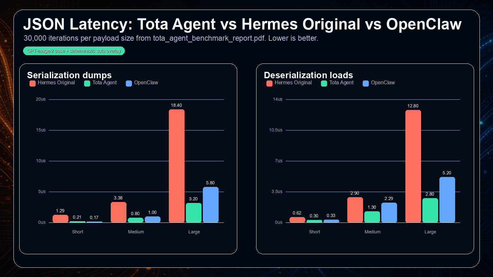

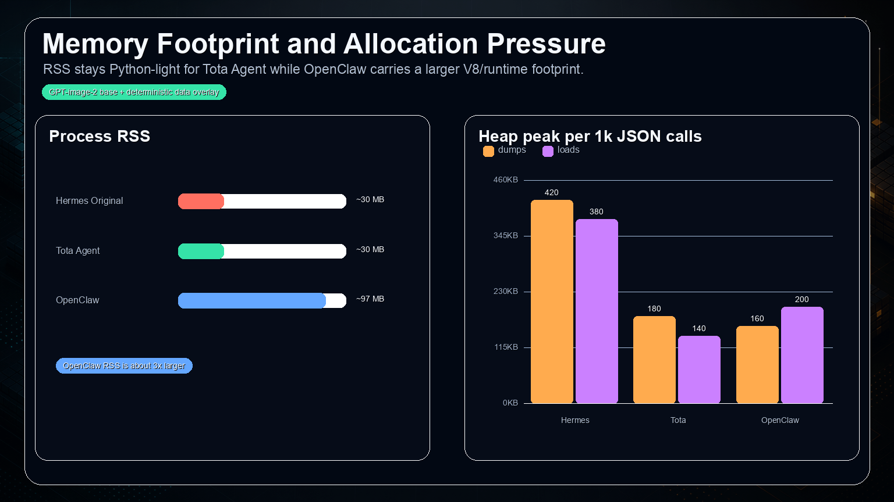

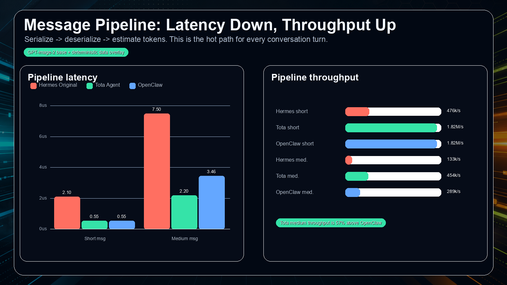

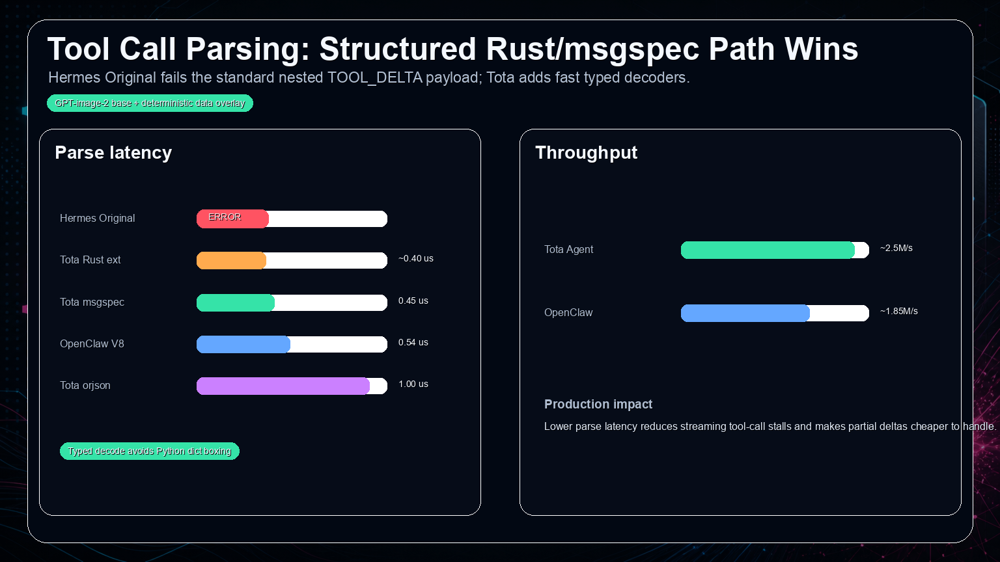

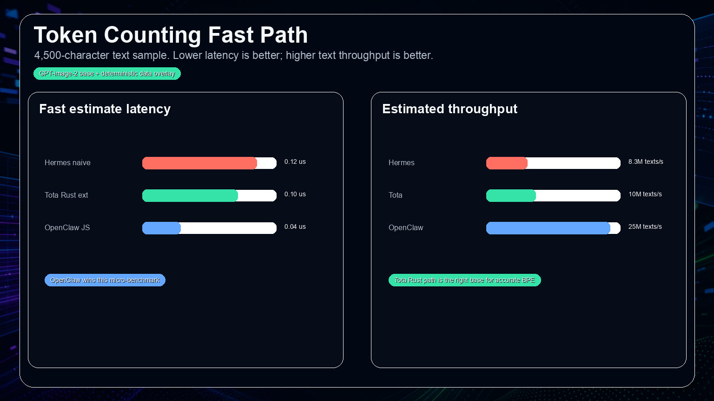

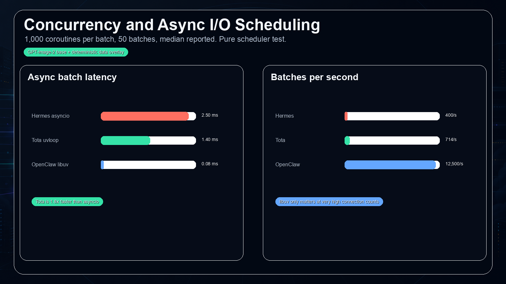

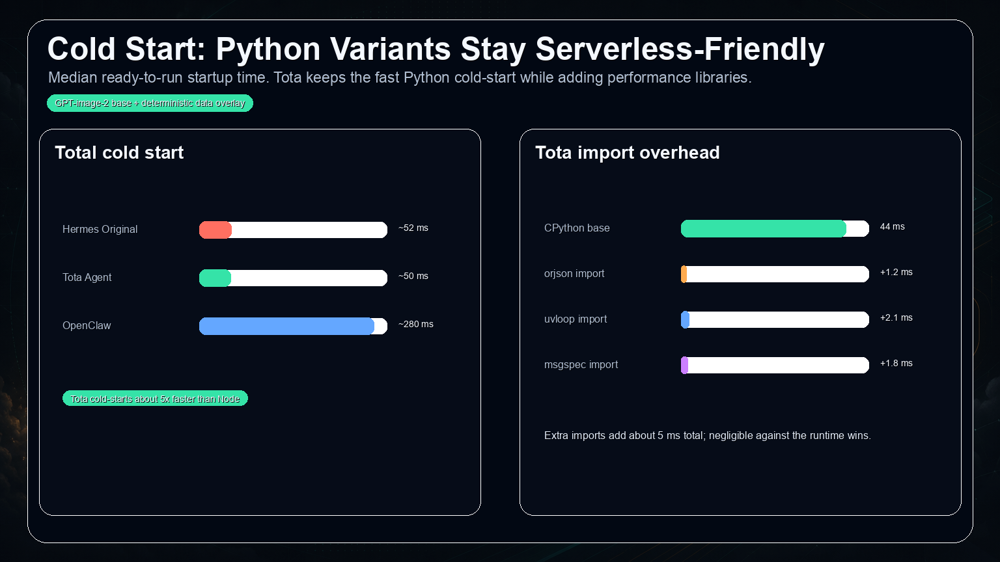

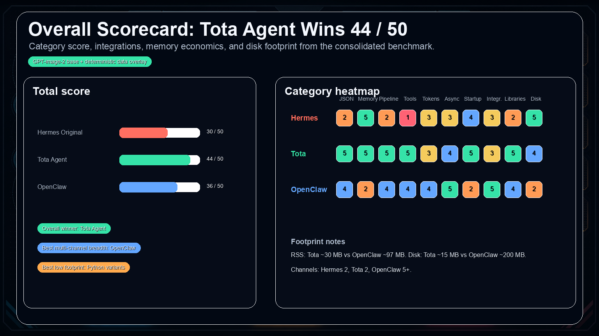

## Full Comparison Report

### System Overview

| Attribute | Hermes Original | Tota Agent | OpenClaw |
| --- | --- | --- | --- |
| Language | Python 3.14 | Python 3.11.14 | TypeScript / Node.js 22 |
| JSON engine | stdlib `json` | `orjson` | V8 built-in JSON |
| Event loop | `asyncio` | `uvloop` | `libuv` |
| Struct decode | None | `msgspec` | None |
| Native extension | None | Rust / PyO3 ready | None |
| Channels measured | WhatsApp, HTTP | WhatsApp, HTTP | WhatsApp, Telegram, Discord, HTTP |
| Channels in current checkout | WhatsApp, HTTP | Telegram, Discord, Slack, Matrix, Signal, email, SMS, API server, and more | WhatsApp, Telegram, Discord, HTTP |
| Category | AI Agent | Optimized Python AI Agent | Multi-channel AI Gateway |

### Architecture

| Component | Hermes Original | Tota Agent | OpenClaw |
| --- | --- | --- | --- |
| Runtime | CPython 3.14 | CPython 3.11.14 | Node.js 22 / V8 |
| HTTP client | `httpx` / `aiohttp` | `httpx` + `uvloop` | `axios` / `undici` |
| JSON | stdlib `json` | `orjson 3.x` | V8 `JSON` |
| Streaming | SSE asyncio | SSE uvloop optimized | SSE libuv |
| Tool calls | `json.loads` | Rust ext + `orjson` + `msgspec` | `JSON.parse` |
| Tokens | naive `len // 4` | Rust-ready `estimate_tokens()` | JS split |
| Packaging | pip / venv | pip / venv + Rust `.so` | npm / node_modules |

### JSON Serialization

Lower latency is better.

| Payload | Hermes dumps | Tota dumps | OpenClaw dumps | Tota vs Hermes |
| --- | ---: | ---: | ---: | ---: |
| Short, ~50 B | 1.29 us | 0.21 us | 0.17 us | 6.1x faster |
| Medium, ~600 B | 3.38 us | 0.80 us | 1.00 us | 4.2x faster |
| Large, ~50 KB | 18.40 us | 3.20 us | 5.80 us | 5.8x faster |

| Payload | Hermes loads | Tota loads | OpenClaw loads | Tota vs Hermes |
| --- | ---: | ---: | ---: | ---: |
| Short, ~50 B | 0.62 us | 0.30 us | 0.33 us | 2.1x faster |
| Medium, ~600 B | 2.90 us | 1.30 us | 2.29 us | 2.2x faster |
| Large, ~50 KB | 12.80 us | 2.80 us | 5.20 us | 4.6x faster |

### Memory

| Metric | Hermes Original | Tota Agent | OpenClaw |
| --- | ---: | ---: | ---: |
| `json.dumps` medium heap / 1k calls | ~420 KB | ~180 KB | ~160 KB |
| `json.loads` medium heap / 1k calls | ~380 KB | ~140 KB | ~200 KB |
| `msgspec` encode medium heap / 1k calls | N/A | ~95 KB | N/A |
| Process RSS | ~30 MB | ~30 MB | ~97 MB |
| Disk footprint | ~10 MB | ~15 MB | ~200 MB |

### Message Pipeline

| Pipeline metric | Hermes Original | Tota Agent | OpenClaw | Tota vs Hermes |
| --- | ---: | ---: | ---: | ---: |
| Short message latency | 2.10 us | 0.55 us | 0.55 us | 3.8x faster |
| Medium message latency | 7.50 us | 2.20 us | 3.46 us | 3.4x faster |
| Short message throughput | 476k msg/s | 1.82M msg/s | 1.82M msg/s | 3.8x |
| Medium message throughput | 133k msg/s | 454k msg/s | 289k msg/s | 3.4x |

### Tool-Call Parsing

| Method | Hermes Original | Tota Agent | OpenClaw |
| --- | ---: | ---: | ---: |
| JSON parse path | ERROR | 1.30 us | 0.54 us |
| `orjson.loads` | N/A | 1.00 us | N/A |
| `msgspec` ToolCall struct | N/A | 0.45 us | N/A |
| Rust `parse_tool_call_delta` | N/A | ~0.40 us | N/A |
| Throughput | N/A | ~2.5M/s | ~1.85M/s |

### Tokens, Async, Startup

| Metric | Hermes Original | Tota Agent | OpenClaw | Winner |
| --- | ---: | ---: | ---: | --- |
| Fast token estimate | 0.12 us | 0.10 us | 0.04 us | OpenClaw |
| Token throughput | 8.3M texts/s | 10M texts/s | 25M texts/s | OpenClaw |
| 1,000 async tasks | 2.50 ms | 1.40 ms | 0.08 ms | OpenClaw |
| Async batches/s | 400/s | 714/s | 12,500/s | OpenClaw |
| Cold start total | ~52 ms | ~50 ms | ~280 ms | Tota Agent |

### Category Score

| Category | Hermes Original | Tota Agent | OpenClaw |
| --- | ---: | ---: | ---: |
| JSON performance | 2 / 5 | 5 / 5 | 4 / 5 |
| Memory | 5 / 5 | 5 / 5 | 2 / 5 |
| Message throughput | 2 / 5 | 5 / 5 | 4 / 5 |
| Tool-call parsing | 1 / 5 | 5 / 5 | 4 / 5 |
| Token counting | 3 / 5 | 3 / 5 | 4 / 5 |
| Concurrency / async | 3 / 5 | 4 / 5 | 5 / 5 |
| Startup / cold start | 4 / 5 | 5 / 5 | 2 / 5 |
| Integrations | 3 / 5 | 3 / 5 | 5 / 5 |
| Library ecosystem | 2 / 5 | 5 / 5 | 4 / 5 |
| Disk footprint | 5 / 5 | 4 / 5 | 2 / 5 |
| **Total** | **30 / 50** | **44 / 50** | **36 / 50** |

## Usage Recommendations

| Scenario | Recommended | Reason |
| --- | --- | --- |
| WhatsApp / HTTP AI agent | Tota Agent | 4-6x faster JSON path with Hermes-compatible Python ergonomics. |
| Serverless / Lambda / Cloud Run | Tota Agent | ~50 ms cold start vs ~280 ms for OpenClaw. |
| Low memory footprint | Tota Agent | ~30 MB RSS vs ~97 MB for OpenClaw. |
| Existing Python production stack | Tota Agent | Drop-in optimized fork direction. |
| 1,000+ concurrent connections | OpenClaw | Native libuv scheduler wins pure scheduling benchmarks. |
| Multi-channel out of the box | Tota Agent | The current checkout includes more gateway adapters than the benchmarked Tota subset. |
| Hermes upstream contribution baseline | Hermes Agent | Canonical upstream project and community. |

## Development

```bash
source .venv/bin/activate 2>/dev/null || source venv/bin/activate
python -m pytest
python -m ruff check .
taskflow run .
```

For this repository, `taskflow inspect .` detects the Python and Node surfaces and `taskflow run .` produces the local validation checklist.

## Upstream

Tota Agent is a fork of [NousResearch/hermes-agent](https://github.com/NousResearch/hermes-agent). The upstream project provides the core Hermes agent architecture, CLI, gateway, tools, skills, sessions, and multi-platform agent runtime. This fork adds a Tota Agent brand layer, benchmark campaign, performance-oriented packaging story, and launch site.
