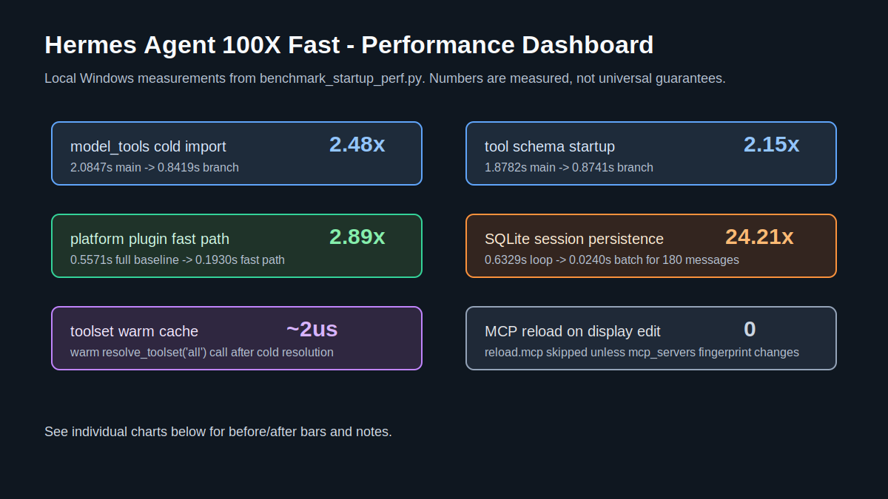
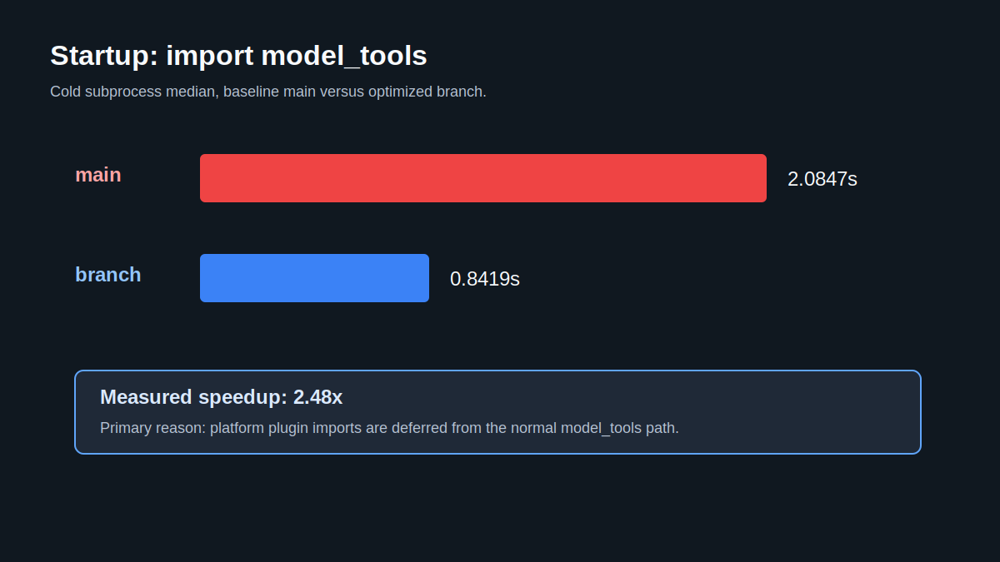
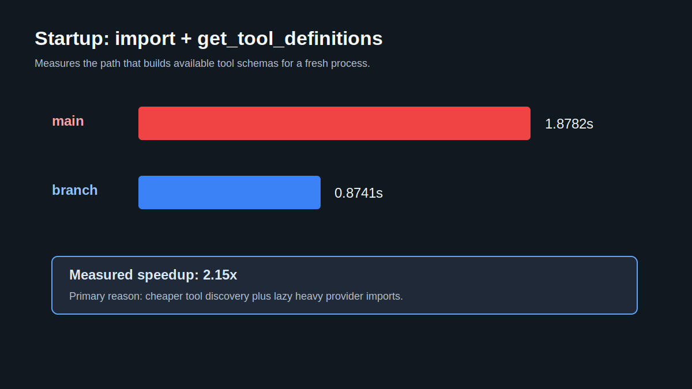
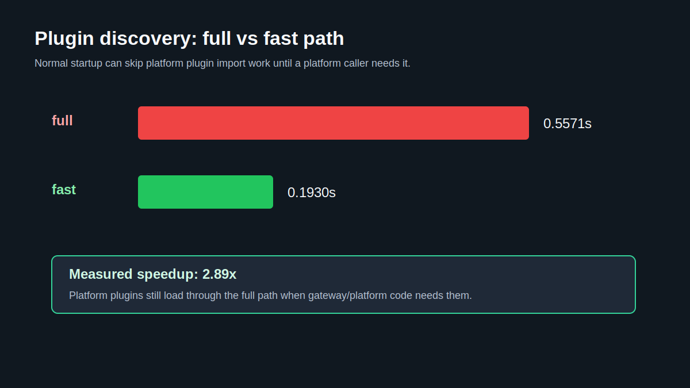
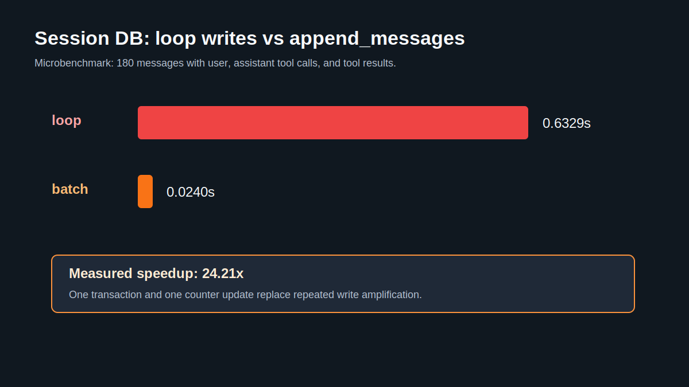
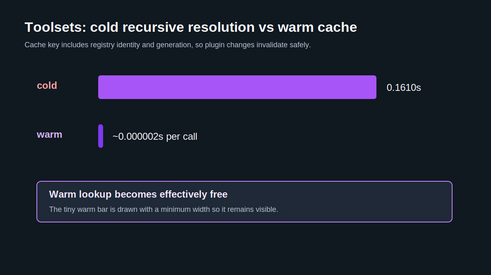
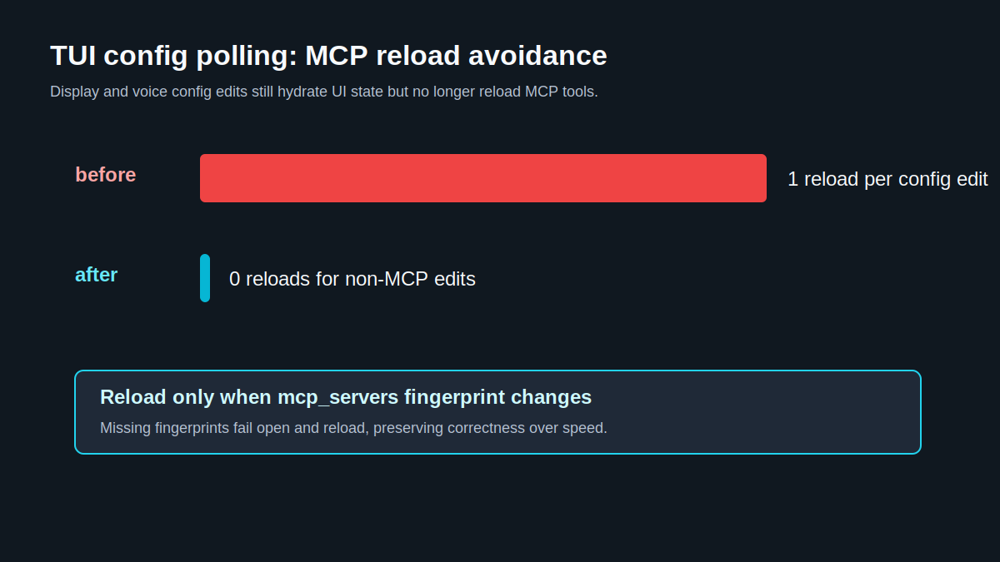
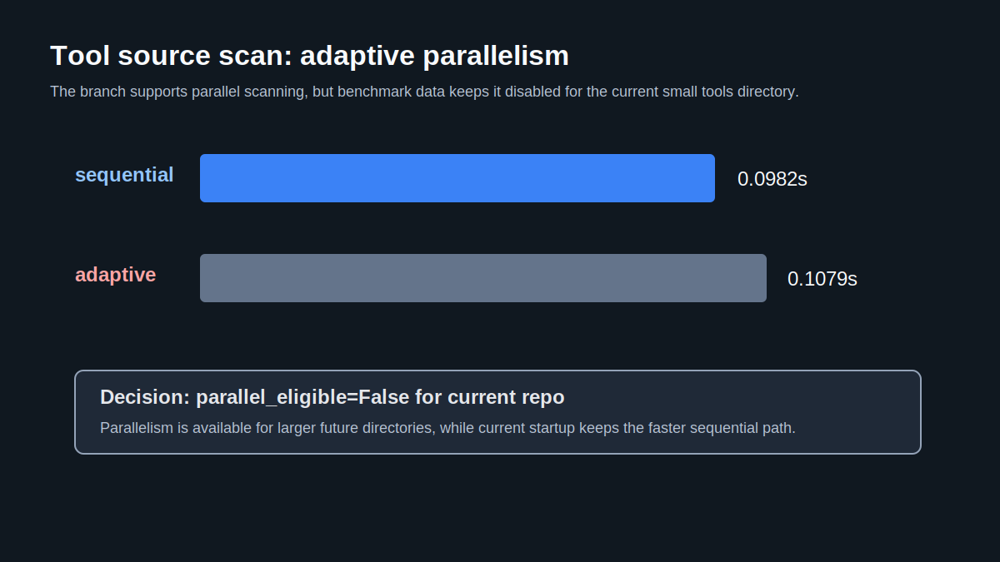

<p align="center">
  
</p>

# Hermes Agent ☤

<p align="center">
  <a href="https://hermes-agent.nousresearch.com/docs/"></a>
  <a href="https://discord.gg/NousResearch"></a>
  <a href="https://github.com/NousResearch/hermes-agent/blob/main/LICENSE"></a>
  <a href="https://nousresearch.com"></a>
  <a href="README.zh-CN.md"></a>
</p>

**The self-improving AI agent built by [Nous Research](https://nousresearch.com).** It's the only agent with a built-in learning loop — it creates skills from experience, improves them during use, nudges itself to persist knowledge, searches its own past conversations, and builds a deepening model of who you are across sessions. Run it on a $5 VPS, a GPU cluster, or serverless infrastructure that costs nearly nothing when idle. It's not tied to your laptop — talk to it from Telegram while it works on a cloud VM.

Use any model you want — [Nous Portal](https://portal.nousresearch.com), [OpenRouter](https://openrouter.ai) (200+ models), [NVIDIA NIM](https://build.nvidia.com) (Nemotron), [Xiaomi MiMo](https://platform.xiaomimimo.com), [z.ai/GLM](https://z.ai), [Kimi/Moonshot](https://platform.moonshot.ai), [MiniMax](https://www.minimax.io), [Hugging Face](https://huggingface.co), OpenAI, or your own endpoint. Switch with `hermes model` — no code changes, no lock-in.

<table>
<tr><td><b>A real terminal interface</b></td><td>Full TUI with multiline editing, slash-command autocomplete, conversation history, interrupt-and-redirect, and streaming tool output.</td></tr>
<tr><td><b>Lives where you do</b></td><td>Telegram, Discord, Slack, WhatsApp, Signal, and CLI — all from a single gateway process. Voice memo transcription, cross-platform conversation continuity.</td></tr>
<tr><td><b>A closed learning loop</b></td><td>Agent-curated memory with periodic nudges. Autonomous skill creation after complex tasks. Skills self-improve during use. FTS5 session search with LLM summarization for cross-session recall. <a href="https://github.com/plastic-labs/honcho">Honcho</a> dialectic user modeling. Compatible with the <a href="https://agentskills.io">agentskills.io</a> open standard.</td></tr>
<tr><td><b>Scheduled automations</b></td><td>Built-in cron scheduler with delivery to any platform. Daily reports, nightly backups, weekly audits — all in natural language, running unattended.</td></tr>
<tr><td><b>Delegates and parallelizes</b></td><td>Spawn isolated subagents for parallel workstreams. Write Python scripts that call tools via RPC, collapsing multi-step pipelines into zero-context-cost turns.</td></tr>
<tr><td><b>Runs anywhere, not just your laptop</b></td><td>Seven terminal backends — local, Docker, SSH, Singularity, Modal, Daytona, and Vercel Sandbox. Daytona and Modal offer serverless persistence — your agent's environment hibernates when idle and wakes on demand, costing nearly nothing between sessions. Run it on a $5 VPS or a GPU cluster.</td></tr>
<tr><td><b>Research-ready</b></td><td>Batch trajectory generation, Atropos RL environments, trajectory compression for training the next generation of tool-calling models.</td></tr>
</table>

---

## Hermes Agent 100X Fast - Performance Comparisons

This branch documents a measured performance pass focused on startup hot paths,
tool discovery, SQLite session persistence, TUI MCP reloads, adaptive
parallelism, delegation config reuse, parallel guard fast paths, model metadata
disk caching, and runtime local-endpoint probe avoidance. The numbers below are
local Windows benchmark results from `scripts/benchmark_startup_perf.py` and
`scripts/benchmark_runtime_usage.py`; they are measurements for this branch, not
universal guarantees.

Full PR documentation:

- [Upstream PR draft](docs/hermes-performance-upstream-pr.md)
- [100X Fast implementation notes](docs/hermes-agent-100x-fast-pr.md)
- [Regression log and next-version playbook](docs/hermes-100x-fast-regression-log.md)
- [Reapply playbook for future Hermes updates](docs/hermes-100x-fast-reapply-playbook.md)
- [Runtime performance investigation](docs/runtime-performance-investigation-2026-05-15.md)




### 90-Second Launch Video

<video src="docs/assets/100x-fast/video/hermes-100x-fast-launch.mp4" controls poster="docs/assets/100x-fast/video/hermes-100x-fast-poster.png" width="100%"></video>

[Watch the rendered MP4](docs/assets/100x-fast/video/hermes-100x-fast-launch.mp4) ·
[Open the poster](docs/assets/100x-fast/video/hermes-100x-fast-poster.png) ·
[Edit the Remotion source](docs/remotion/100x-fast/src/Hermes100xVideo.tsx) ·
[Storyboard](docs/remotion/100x-fast/STORYBOARD.md)


### Visual Before/After Gallery


### Startup And Tool Schema







### Runtime Hot Paths










### Research To Code


This runtime pass cross-checked the official Hermes docs for the
[agent loop](https://hermes-agent.nousresearch.com/docs/developer-guide/agent-loop/),
[tools runtime](https://hermes-agent.nousresearch.com/docs/developer-guide/tools-runtime),
[delegation](https://hermes-agent.nousresearch.com/docs/guides/delegation-patterns/),
and [context compression](https://hermes-agent.nousresearch.com/docs/developer-guide/context-compression-and-caching/).
The research logic comes from efficient LLM systems work such as
[FrugalGPT](https://arxiv.org/abs/2305.05176),
[LLMLingua](https://arxiv.org/abs/2310.05736),
[vLLM/PagedAttention](https://arxiv.org/abs/2309.06180), and
[RouteLLM](https://arxiv.org/abs/2406.18665): route cheap first, compress or
cache stable work, batch tiny writes, and avoid probes that cannot produce
signal.

### Architecture Diagrams


---

## Quick Install

### Linux, macOS, WSL2, Termux

```bash
curl -fsSL https://raw.githubusercontent.com/NousResearch/hermes-agent/main/scripts/install.sh | bash
```

### Windows (native, PowerShell) — Early Beta

> **Heads up:** Native Windows support is **early beta**. It installs and runs, but hasn't been road-tested as broadly as our Linux/macOS/WSL2 paths. Please [file issues](https://github.com/NousResearch/hermes-agent/issues) when you hit rough edges. For the most battle-tested Windows setup today, run the Linux/macOS one-liner above inside **WSL2**.

Run this in PowerShell:

```powershell
irm https://raw.githubusercontent.com/NousResearch/hermes-agent/main/scripts/install.ps1 | iex
```

The installer handles everything: uv, Python 3.11, Node.js, ripgrep, ffmpeg, **and a portable Git Bash** (MinGit, unpacked to `%LOCALAPPDATA%\hermes\git` — no admin required, completely isolated from any system Git install).  Hermes uses this bundled Git Bash to run shell commands.

If you already have Git installed, the installer detects it and uses that instead.  Otherwise a ~45MB MinGit download is all you need — it won't touch or interfere with any system Git.

> **Android / Termux:** The tested manual path is documented in the [Termux guide](https://hermes-agent.nousresearch.com/docs/getting-started/termux). On Termux, Hermes installs a curated `.[termux]` extra because the full `.[all]` extra currently pulls Android-incompatible voice dependencies.
>
> **Windows:** Native Windows is supported as an **early beta** — the PowerShell one-liner above installs everything, but expect rough edges and please file issues when you hit them. If you'd rather use WSL2 (our most battle-tested Windows path), the Linux command works there too. Native Windows install lives under `%LOCALAPPDATA%\hermes`; WSL2 installs under `~/.hermes` as on Linux.  The only Hermes feature that currently needs WSL2 specifically is the browser-based dashboard chat pane (it uses a POSIX PTY — classic CLI and gateway both run natively).

After installation:

```bash
source ~/.bashrc    # reload shell (or: source ~/.zshrc)
hermes              # start chatting!
```

---

## Getting Started

```bash
hermes              # Interactive CLI — start a conversation
hermes model        # Choose your LLM provider and model
hermes tools        # Configure which tools are enabled
hermes config set   # Set individual config values
hermes gateway      # Start the messaging gateway (Telegram, Discord, etc.)
hermes setup        # Run the full setup wizard (configures everything at once)
hermes claw migrate # Migrate from OpenClaw (if coming from OpenClaw)
hermes update       # Update to the latest version
hermes doctor       # Diagnose any issues
```

📖 **[Full documentation →](https://hermes-agent.nousresearch.com/docs/)**

## CLI vs Messaging Quick Reference

Hermes has two entry points: start the terminal UI with `hermes`, or run the gateway and talk to it from Telegram, Discord, Slack, WhatsApp, Signal, or Email. Once you're in a conversation, many slash commands are shared across both interfaces.

| Action | CLI | Messaging platforms |
|---------|-----|---------------------|
| Start chatting | `hermes` | Run `hermes gateway setup` + `hermes gateway start`, then send the bot a message |
| Start fresh conversation | `/new` or `/reset` | `/new` or `/reset` |
| Change model | `/model [provider:model]` | `/model [provider:model]` |
| Set a personality | `/personality [name]` | `/personality [name]` |
| Retry or undo the last turn | `/retry`, `/undo` | `/retry`, `/undo` |
| Compress context / check usage | `/compress`, `/usage`, `/insights [--days N]` | `/compress`, `/usage`, `/insights [days]` |
| Browse skills | `/skills` or `/<skill-name>` | `/<skill-name>` |
| Interrupt current work | `Ctrl+C` or send a new message | `/stop` or send a new message |
| Platform-specific status | `/platforms` | `/status`, `/sethome` |

For the full command lists, see the [CLI guide](https://hermes-agent.nousresearch.com/docs/user-guide/cli) and the [Messaging Gateway guide](https://hermes-agent.nousresearch.com/docs/user-guide/messaging).

---

## Documentation

All documentation lives at **[hermes-agent.nousresearch.com/docs](https://hermes-agent.nousresearch.com/docs/)**:

| Section | What's Covered |
|---------|---------------|
| [Quickstart](https://hermes-agent.nousresearch.com/docs/getting-started/quickstart) | Install → setup → first conversation in 2 minutes |
| [CLI Usage](https://hermes-agent.nousresearch.com/docs/user-guide/cli) | Commands, keybindings, personalities, sessions |
| [Configuration](https://hermes-agent.nousresearch.com/docs/user-guide/configuration) | Config file, providers, models, all options |
| [Messaging Gateway](https://hermes-agent.nousresearch.com/docs/user-guide/messaging) | Telegram, Discord, Slack, WhatsApp, Signal, Home Assistant |
| [Security](https://hermes-agent.nousresearch.com/docs/user-guide/security) | Command approval, DM pairing, container isolation |
| [Tools & Toolsets](https://hermes-agent.nousresearch.com/docs/user-guide/features/tools) | 40+ tools, toolset system, terminal backends |
| [Skills System](https://hermes-agent.nousresearch.com/docs/user-guide/features/skills) | Procedural memory, Skills Hub, creating skills |
| [Memory](https://hermes-agent.nousresearch.com/docs/user-guide/features/memory) | Persistent memory, user profiles, best practices |
| [MCP Integration](https://hermes-agent.nousresearch.com/docs/user-guide/features/mcp) | Connect any MCP server for extended capabilities |
| [Cron Scheduling](https://hermes-agent.nousresearch.com/docs/user-guide/features/cron) | Scheduled tasks with platform delivery |
| [Context Files](https://hermes-agent.nousresearch.com/docs/user-guide/features/context-files) | Project context that shapes every conversation |
| [Architecture](https://hermes-agent.nousresearch.com/docs/developer-guide/architecture) | Project structure, agent loop, key classes |
| [Contributing](https://hermes-agent.nousresearch.com/docs/developer-guide/contributing) | Development setup, PR process, code style |
| [CLI Reference](https://hermes-agent.nousresearch.com/docs/reference/cli-commands) | All commands and flags |
| [Environment Variables](https://hermes-agent.nousresearch.com/docs/reference/environment-variables) | Complete env var reference |

---

## Migrating from OpenClaw

If you're coming from OpenClaw, Hermes can automatically import your settings, memories, skills, and API keys.

**During first-time setup:** The setup wizard (`hermes setup`) automatically detects `~/.openclaw` and offers to migrate before configuration begins.

**Anytime after install:**

```bash
hermes claw migrate              # Interactive migration (full preset)
hermes claw migrate --dry-run    # Preview what would be migrated
hermes claw migrate --preset user-data   # Migrate without secrets
hermes claw migrate --overwrite  # Overwrite existing conflicts
```

What gets imported:
- **SOUL.md** — persona file
- **Memories** — MEMORY.md and USER.md entries
- **Skills** — user-created skills → `~/.hermes/skills/openclaw-imports/`
- **Command allowlist** — approval patterns
- **Messaging settings** — platform configs, allowed users, working directory
- **API keys** — allowlisted secrets (Telegram, OpenRouter, OpenAI, Anthropic, ElevenLabs)
- **TTS assets** — workspace audio files
- **Workspace instructions** — AGENTS.md (with `--workspace-target`)

See `hermes claw migrate --help` for all options, or use the `openclaw-migration` skill for an interactive agent-guided migration with dry-run previews.

---

## Contributing

We welcome contributions! See the [Contributing Guide](https://hermes-agent.nousresearch.com/docs/developer-guide/contributing) for development setup, code style, and PR process.

Quick start for contributors — clone and go with `setup-hermes.sh`:

```bash
git clone https://github.com/NousResearch/hermes-agent.git
cd hermes-agent
./setup-hermes.sh     # installs uv, creates venv, installs .[all], symlinks ~/.local/bin/hermes
./hermes              # auto-detects the venv, no need to `source` first
```

Manual path (equivalent to the above):

```bash
curl -LsSf https://astral.sh/uv/install.sh | sh
uv venv .venv --python 3.11
source .venv/bin/activate
uv pip install -e ".[all,dev]"
scripts/run_tests.sh
```

> **RL Training (optional):** The RL/Atropos integration (`environments/`) — see [`CONTRIBUTING.md`](https://github.com/NousResearch/hermes-agent/blob/main/CONTRIBUTING.md#development-setup) for the full setup.

---

## Community

- 💬 [Discord](https://discord.gg/NousResearch)
- 📚 [Skills Hub](https://agentskills.io)
- 🐛 [Issues](https://github.com/NousResearch/hermes-agent/issues)
- 🔌 [HermesClaw](https://github.com/AaronWong1999/hermesclaw) — Community WeChat bridge: Run Hermes Agent and OpenClaw on the same WeChat account.

---

## License

MIT — see [LICENSE](LICENSE).

Built by [Nous Research](https://nousresearch.com).
