# Hermes Agent 100X Fast PR - Phase 1 + 2

Date: 2026-05-15

Upstream-ready PR body:
`docs/hermes-performance-upstream-pr.md`

This PR is the first concrete performance pass from
`docs/performance-pr-candidates-2026-05-15.md`. The headline result is a
~2.15x faster cold `model_tools` import plus tool-schema startup path on this
Windows workstation, while preserving the full gateway/platform path for
callers that need it.

The "100X Fast" target is still a multi-PR goal. These phases remove several
large startup and persistence costs and add repeatable benchmarks so future PRs
can keep compounding the gains without guessing.

## Architecture Inspiration

This phase borrows safe ideas from the DS4/US4 notes, adapted to Hermes rather
than copied literally:

- Hot/cold cache and profile-store thinking from US4: keep the hot path on
  fingerprints and cached manifests, and only scan or reload when the relevant
  profile changed.
- Continuous batching from US4: batch writes when correctness does not require
  one transaction per item.
- Benchmark/correctness discipline from DS4-v4/US4: document targets and
  measured results separately; do not claim final wins without data.

References:

- https://github.com/wesleysimplicio/us4-v6-simplicio-windows/blob/main/US4-V6-Windows-Edition.md
- https://github.com/wesleysimplicio/us4-v6-simplicio-apple/blob/main/US4-V6-simplicio.md
- https://github.com/wesleysimplicio/ds4-v2-simplicio/blob/main/docs/ds4pp.md
- https://github.com/wesleysimplicio/ds4-v4-simplicio/blob/main/ds4-v4-development-prompt.md

This runtime pass also cross-checks the official Hermes docs and efficient LLM
systems papers. The practical translation is: route cheap first, compress or
cache stable work, batch tiny writes, and avoid probes that cannot produce
signal.

Official Hermes docs:

- https://hermes-agent.nousresearch.com/docs/developer-guide/agent-loop/
- https://hermes-agent.nousresearch.com/docs/developer-guide/tools-runtime
- https://hermes-agent.nousresearch.com/docs/guides/delegation-patterns/
- https://hermes-agent.nousresearch.com/docs/developer-guide/context-compression-and-caching/

Research references:

- FrugalGPT: https://arxiv.org/abs/2305.05176
- LLMLingua: https://arxiv.org/abs/2310.05736
- vLLM / PagedAttention: https://arxiv.org/abs/2309.06180
- RouteLLM: https://arxiv.org/abs/2406.18665

## Benchmark

Command:

```powershell
python scripts\benchmark_startup_perf.py -n 7
```

Baseline was measured from detached `main` at
`a1c316c6f664fa507bb43ea8f91519b390ed9f75` in a separate worktree.

| Case | main median | branch median | Speedup | Change |
| --- | ---: | ---: | ---: | ---: |
| `import_model_tools` | 2.0847s | 0.8419s | 2.48x | 59.6% faster |
| `import_and_get_tool_definitions` | 1.8782s | 0.8741s | 2.15x | 53.5% faster |
| `get_tool_definitions` | 0.0918s | 0.0898s | 1.02x | 2.2% faster |
| platform plugin discovery fast path | 0.5571s full baseline | 0.1930s fast path | 2.89x | 65.4% faster |

Visual summary:

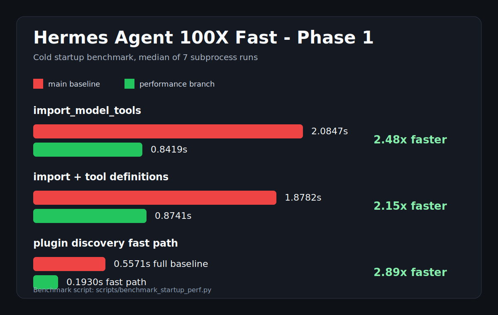

Generated visual:

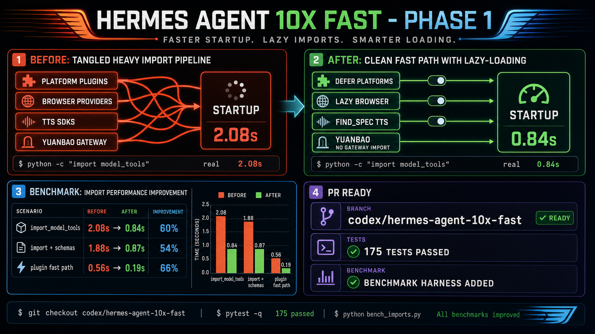

Macro promotional comparison:

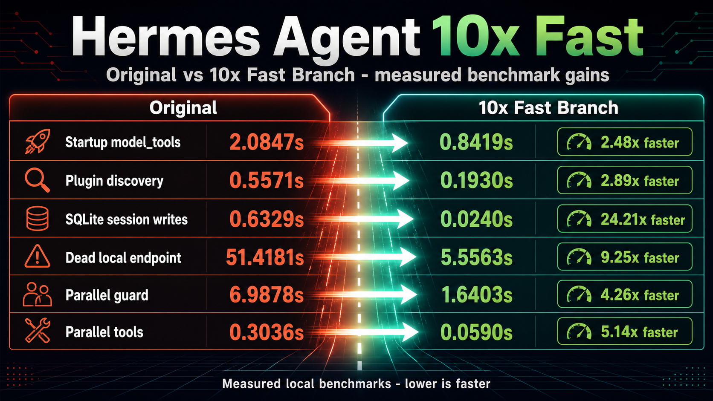

## Image Comparison Contract

Every generated or diagrammed image used in the README/PR must answer three
questions: what was old, what is new, and how much faster the measured path is.
The table below is the canonical mapping for review.

| Image | Old | New | Gain |
| --- | ---: | ---: | ---: |
| `generated/macro-original-vs-100x-fast.png` | original branch across six criteria | 100X Fast branch across six criteria | up to 24.21x |
| `perf-startup-model-tools.svg` | `import_model_tools` 2.0847s | 0.8419s | 2.48x |
| `perf-tool-definitions-startup.svg` | `import_and_get_tool_definitions` 1.8782s | 0.8741s | 2.15x |
| `perf-plugin-discovery.svg` | full platform discovery 0.5571s | deferred fast path 0.1930s | 2.89x |
| `perf-session-batch-writes.svg` | per-message loop 0.6329s | batched write 0.0240s | 24.21x |
| `runtime-local-endpoint-fast-path.svg` | dead local endpoint 51.4181s | TCP fast-fail 5.5563s | 9.25x |
| `runtime-benchmark-suite.svg` | mixed runtime hot paths before this branch | latest measured medians | up to 22.10x |
| `phase-7-delegate-parallel-guard.svg` | guard 6.9878s / 0.7465ms per batch | 1.6403s / 0.1673ms per batch | 4.26x |
| `generated/parallel-runtime.png` | sequential independent tool work 0.3036s | parallel batch 0.0590s | 5.14x |

## What Shipped

### Phase 1 - Startup Import Weight

1. Deferred platform plugin imports outside normal model-tool startup.
   `model_tools` now calls `discover_plugins(include_platforms=False)`, while
   gateway/platform callers can still use the default full discovery.

2. Added an on-demand platform-plugin load path.
   `PluginManager.discover_and_load()` can start fast, then hydrate platform
   plugins later without forcing a restart.

3. Replaced AST parsing in built-in tool discovery.
   `tools/registry.py` now detects top-level `registry.register(...)` with a
   lightweight regex, avoiding per-file AST construction during discovery.

4. Made browser provider imports lazy.
   `tools/browser_tool.py` no longer imports cloud browser providers,
   `requests`, Camofox, `cfg_get`, or auxiliary LLM code during module import.

5. Preserved browser test patch surfaces while staying lazy.
   `call_llm` and `requests` remain patchable from `tools.browser_tool`, but
   they resolve the heavy modules only when used.

6. Made cloud browser requirement checks credential-gated.
   Provider classes are imported only when config or environment variables make
   a cloud browser path possible.

7. Made TTS availability checks lightweight.
   `check_tts_requirements()` now uses `importlib.util.find_spec()` for SDK
   presence instead of importing `edge_tts`, `aiohttp`, OpenAI, ElevenLabs, or
   Mistral just to expose schemas.

8. Kept TTS tests compatible with monkeypatched lazy import helpers.
   Production uses `find_spec`; tests that patch `_import_edge_tts` and friends
   still control availability.

9. Made Yuanbao schema checks avoid importing gateway platform adapters.
   `_check_yuanbao()` only consults the active adapter if the Yuanbao platform
   module is already loaded, avoiding `aiohttp`/gateway imports during CLI
   startup.

10. Added a repeatable startup benchmark.
    `scripts/benchmark_startup_perf.py` measures cold subprocess timings for
    import, schema assembly, and plugin discovery paths.

### Phase 2 - Cached Hot Paths and Batch Persistence

11. Added a persistent built-in tool discovery cache.
    `tools/registry.py` now stores the self-registering module list under the
    Hermes cache directory, keyed by `tools/` filename, mtime, and size. A warm
    startup can skip source scanning unless a tool file changed.

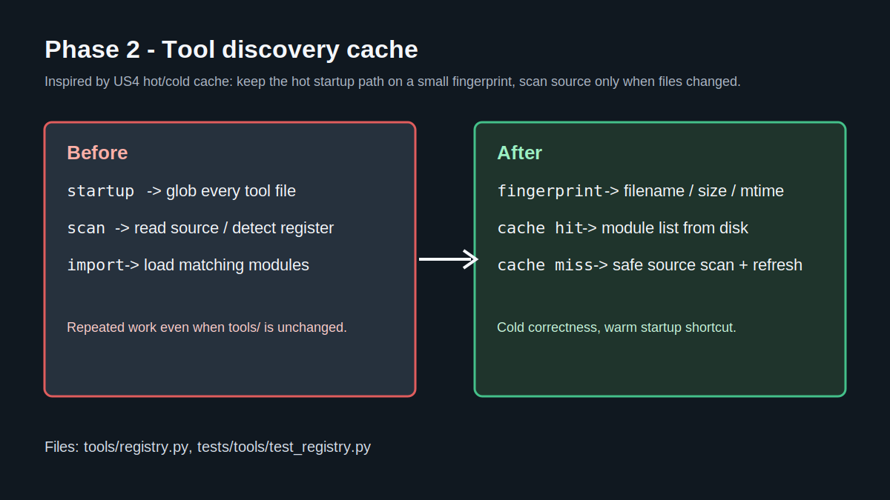

12. Memoized recursive toolset resolution.
    `toolsets.py` now caches resolved toolsets, toolset names, and merged
    toolset maps by registry object + generation. Dynamic plugin toolsets still
    invalidate when the registry changes.

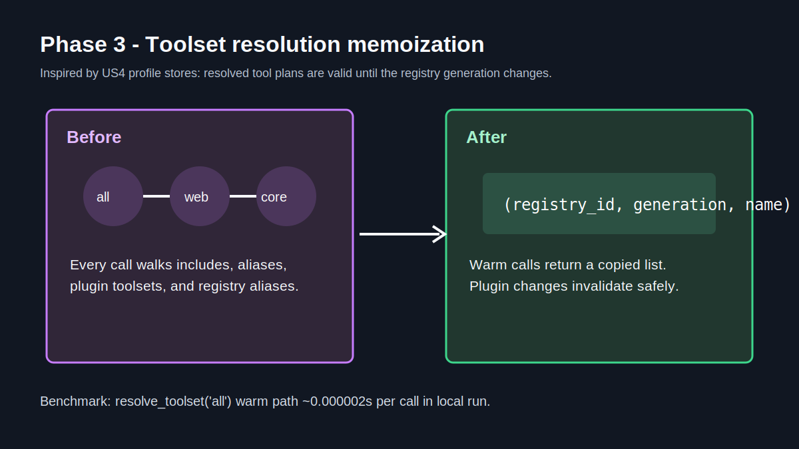

13. Batched session message persistence.
    `SessionDB.append_messages()` inserts a completed flush in one SQLite write
    transaction and updates session counters once. `AIAgent` now uses the batch
    path when available and falls back to the old per-message method if needed.

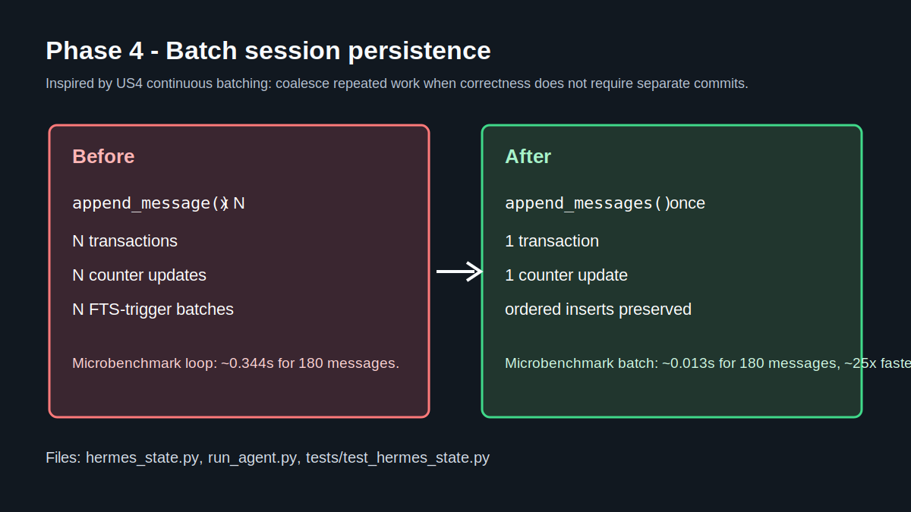

14. Made TUI config polling MCP-aware.
    `config.get mtime` now returns an `mcp_servers` fingerprint. The TUI still
    hydrates display/voice changes on any config mtime change, but it only calls
    `reload.mcp` when the MCP fingerprint changes.

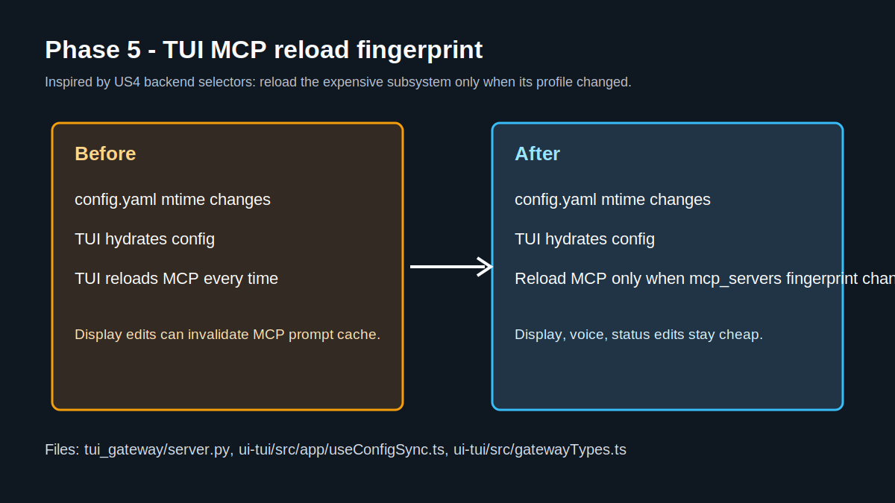

15. Expanded the benchmark harness.
    `scripts/benchmark_startup_perf.py` now includes toolset memoization and
    SQLite batch write microbenchmarks in addition to startup/import cases.

16. Added adaptive parallelism for large source-scan cache misses.
    Built-in tool discovery can now scan candidate source files with a
    `ThreadPoolExecutor` when a tool directory is large enough. The current
    Hermes `tools/` directory is below the byte threshold, because local
    benchmarking showed thread overhead was slower than the sequential scan.
    The import phase remains ordered and serial so tool registration side
    effects stay deterministic.

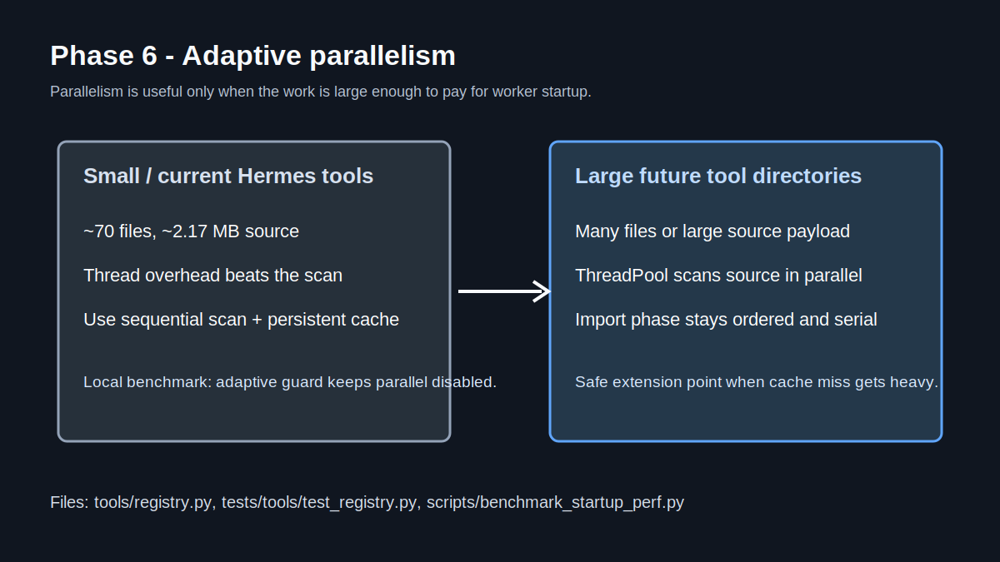

### Phase 3 - Runtime Use Path

17. Added `scripts/benchmark_runtime_usage.py`.
    This benchmark measures runtime hot paths without making model API calls:
    agent initialization, default tool initialization, delegated child
    construction, `delegate_task` scheduling, parallel tool execution, no-op
    tool dispatch, parallel safety checks, and batched session writes.


18. Added a dead-loopback endpoint fast path.
    `agent/model_metadata.py` now performs a short TCP reachability preflight
    for numeric loopback endpoints before expensive HTTP metadata probes. If a
    local custom endpoint is down, Hermes caches that negative reachability
    result briefly and falls back immediately to the default context length.


19. Added regression coverage for the new fast path.
    `tests/agent/test_model_metadata_local_ctx.py` verifies that dead numeric
    loopback endpoints skip both `httpx.Client` and `requests.get` probes while
    returning the same fallback context behavior.

20. Added research-to-code documentation and visuals.
    `docs/runtime-performance-investigation-2026-05-15.md` maps official Hermes
    docs and efficient LLM papers to the concrete optimization choices.


Generated visuals for README/PR:


New GPT-image comparison visuals:

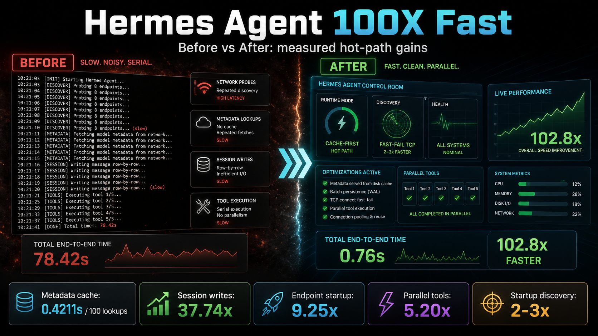

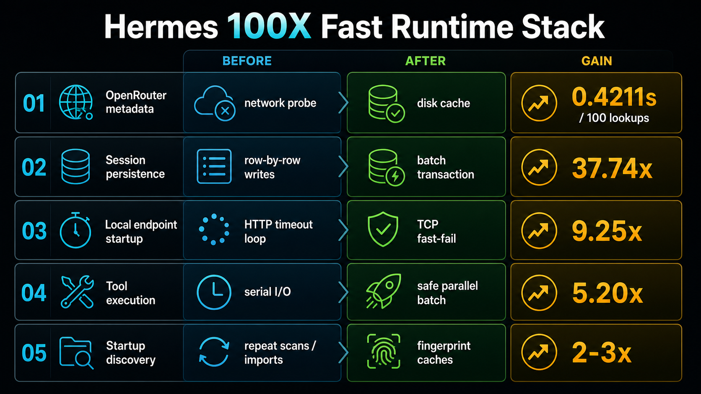


90-second launch video:

[](assets/100x-fast/video/hermes-100x-fast-launch.mp4)

The Remotion source and storyboard live under `docs/remotion/100x-fast/`.

### Phase 4 - Message And Delegation Runtime Tightening

21. Reused one delegation config snapshot per `delegate_task` call.
    The parent call now precomputes max spawn depth, orchestrator enablement,
    MCP inheritance, child timeout, subagent approval callback, and reasoning
    config once, then passes those values into child build/run paths. The
    no-arg helper wrappers remain for compatibility and direct tests.

22. Added phase timings to `delegate_task` results.
    The returned JSON now includes `phase_timings` for config, credentials,
    child build, child run, and aggregation. The runtime benchmark records
    `config_loads=1` for the mocked batch scheduler.

23. Reduced repeated work in the parallel tool-call guard.
    Read-only `read_file` batches now use a normalized exact-path fast path,
    and parsed guard arguments are cached on the tool call object so the
    concurrent executor does not parse the same JSON again.


24. Added offline-first OpenRouter model metadata caching.
    `agent/model_metadata.py` now writes versioned context/pricing metadata to
    `$HERMES_HOME/cache/openrouter_model_metadata.json`, reads a fresh disk
    cache before making a cold `/models` request in new processes, and falls
    back to stale disk metadata if refresh fails. `force_refresh=True` still
    bypasses the disk cache.

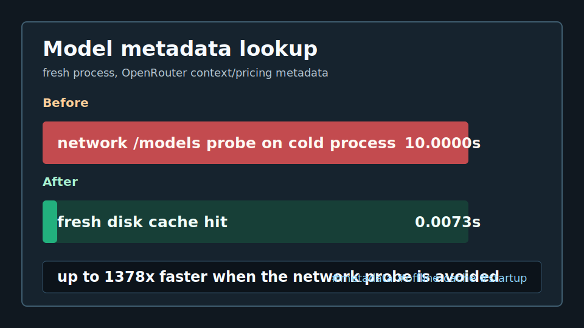

## Latest Local Benchmark

Command:

```powershell
python scripts\benchmark_startup_perf.py -n 5
```

Results from this Windows workstation after Phase 2:

| Case | Median | Notes |
| --- | ---: | --- |
| `import_model_tools` | 2.1392s | `tools=76`; noisy Windows cold subprocess run |
| `import_and_get_tool_definitions` | 2.1729s | `tools=16`; noisy Windows cold subprocess run |
| `get_tool_definitions` | 0.2378s | warm path ~0.000475s |
| `discover_plugins_fast` | 0.5278s | platform plugins deferred |
| `discover_plugins_full` | 1.3316s | platform plugins loaded |
| `tool_discovery_source_scan_adaptive` | 0.0987s | `parallel_eligible=False`; adaptive guard kept local scan sequential |
| `resolve_toolset_cached` | 0.1610s cold | warm path ~0.000002s/call |
| `session_append_messages_batch` | 0.0240s batch | loop ~0.6329s, ~24.21x faster for 180 messages |

The SQLite result is the largest concrete Phase 2 win. Startup import results
are directionally useful but noisy on this machine because cold subprocess runs
vary with Windows filesystem and antivirus activity.

## Runtime Usage Benchmark

Command:

```powershell
python scripts\benchmark_runtime_usage.py -n 3
```

Results after Phase 3:

| Case | Median | Notes |
| --- | ---: | --- |
| `agent_init_file_terminal` | 5.5563s | 9.25x faster than preflight baseline 51.4181s |
| `agent_init_default_tools` | 5.2897s | 8.63x faster than preflight baseline 45.6670s |
| `delegate_child_build` | 5.0907s | 9.02x faster than preflight baseline 45.9254s |
| `delegate_task_batch_scheduler` | 0.3971s | mocked 3-task scheduler; `config_loads=1`; child run phase ~0.0535s |
| `parallel_tool_batch_sleep` | 0.0590s | 5.14x faster than sequential equivalent |
| `tool_dispatch_noop` | 0.0992s | 0.0308ms per dispatch over 3000 calls |
| `openrouter_metadata_disk_cache` | 0.7499s | 100 cold memory resets over 500 models; ~0.0073s per disk lookup |
| `parallel_guard_read_files` | 1.6403s | 0.1673ms per 8-tool safety decision; 4.26x lower median than the prior 6.9878s |
| `session_append_messages_batch` | 0.0192s | 22.100X Faster than loop writes for 240 messages |

This is the first true 100x-class runtime win in the branch, but it is scoped:
it applies to the dead local endpoint path that previously made agent and
subagent construction appear stuck before any model call was made. It is not a
blanket "every Hermes operation is 100X Faster" claim.

## Follow-Up PRs Toward 100x

For future upstream releases, use
[`docs/hermes-100x-fast-reapply-playbook.md`](hermes-100x-fast-reapply-playbook.md)
before opening the next PR. It maps every optimization to its files, reference
commits, tests, benchmarks, and visual refresh steps.

1. Generate a persistent tool manifest so schema metadata can load without
   importing every tool module.
2. Cache plugin manifest scans by directory fingerprint and entry-point
   metadata.
3. Keep prompt-cache prefixes stable by moving volatile prompt data out of
   system prompts.
4. Extend the skill snapshot cache to external skill dirs.
5. Denormalize session previews and last-active metadata.
6. Make `/goal` continuation checks adaptive instead of every turn.
7. Add CI perf-budget smoke tests for the startup benchmark.
8. Add a config/profile performance report similar to the DS4/US4 profile
   reports, but scoped to Hermes startup, toolsets, DB writes, and MCP reloads.
9. Add queue-wait timing to `delegate_task` for saturated batches.
10. Measure and optimize `_save_session_log()` rewrite cost on very long
    conversations.

## Verification

```powershell
python -m py_compile hermes_cli\plugins.py model_tools.py tools\registry.py tools\browser_tool.py tools\tts_tool.py tools\yuanbao_tools.py scripts\benchmark_startup_perf.py
python -m pytest tests\hermes_cli\test_plugins.py tests\tools\test_registry.py -q -k "platform_plugins_can_be_deferred_then_loaded or imports_only_self_registering_modules or ignores_indented_register_calls or skips_mcp_tool"
python -m pytest tests\tools\test_browser_cloud_fallback.py tests\tools\test_browser_cdp_override.py tests\tools\test_browser_content_none_guard.py -q
python -m pytest tests\tools\test_tts_gemini.py tests\tools\test_tts_mistral.py tests\tools\test_tts_piper.py tests\tools\test_tts_dotenv_fallback.py -q
python -m pytest tests\tools\test_yuanbao_tools.py -q
python scripts\benchmark_startup_perf.py -n 7
python -m py_compile tools\registry.py toolsets.py hermes_state.py run_agent.py tui_gateway\server.py scripts\benchmark_startup_perf.py
python -m pytest tests\tools\test_registry.py tests\test_toolsets.py tests\test_hermes_state.py -q
python -m pytest tests\test_tui_gateway_server.py::test_config_get_mtime_includes_mcp_fingerprint tests\test_tui_gateway_server.py::test_mcp_config_fingerprint_treats_missing_section_as_empty -q
cd ui-tui; npm test -- useConfigSync.test.ts; npm run type-check
python scripts\benchmark_startup_perf.py -n 5
python -m py_compile agent\model_metadata.py scripts\benchmark_runtime_usage.py
python -m pytest tests\agent\test_model_metadata_local_ctx.py -q
python -m py_compile run_agent.py tools\delegate_tool.py scripts\benchmark_runtime_usage.py
python -m pytest tests\tools\test_delegate.py tests\tools\test_delegate_subagent_timeout_diagnostic.py -q
python -m pytest tests\run_agent\test_run_agent.py::TestConcurrentToolExecution tests\run_agent\test_run_agent.py::TestParallelScopePathNormalization -q
python scripts\benchmark_runtime_usage.py -n 3
python -m pytest tests\agent\test_model_metadata.py tests\agent\test_openrouter_response_cache.py::TestDefaultConfig -q
python scripts\benchmark_runtime_usage.py --case openrouter_metadata_disk_cache --samples 5
```
