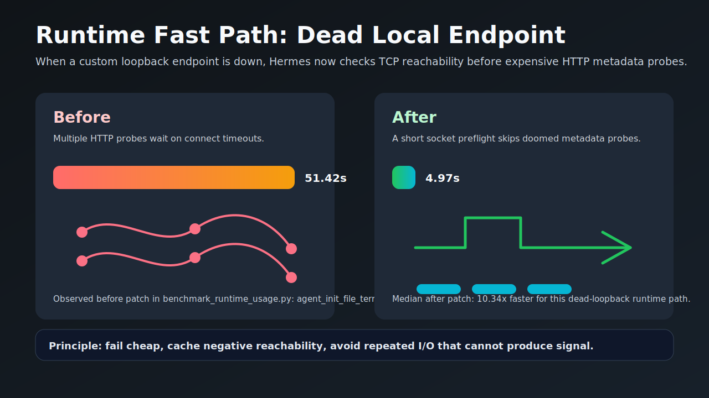
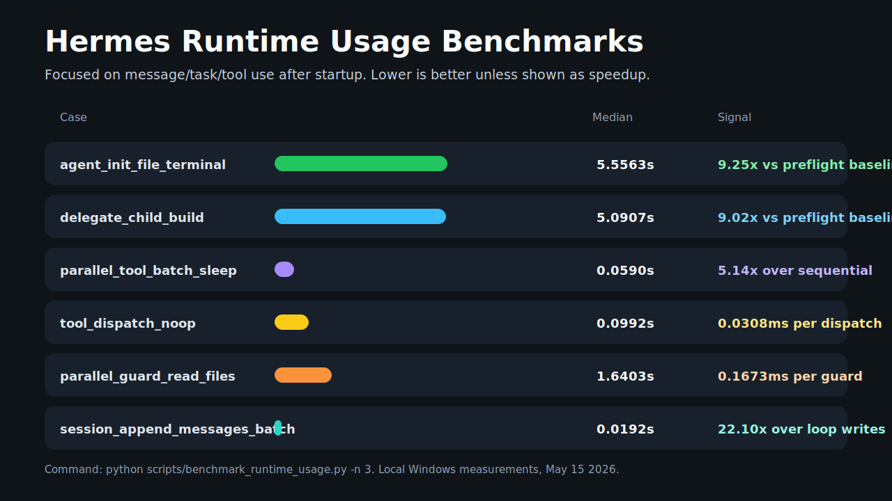
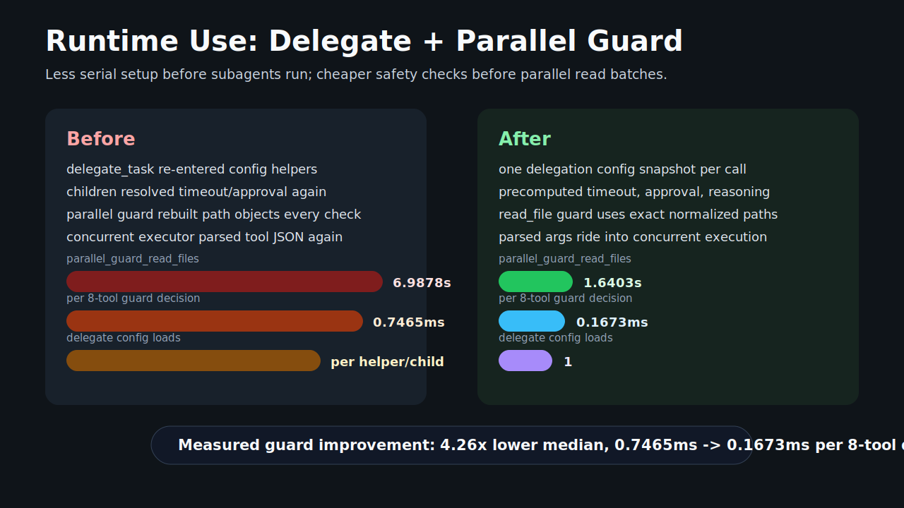
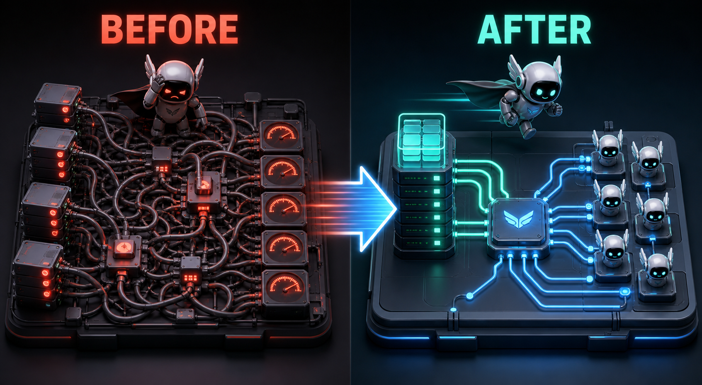
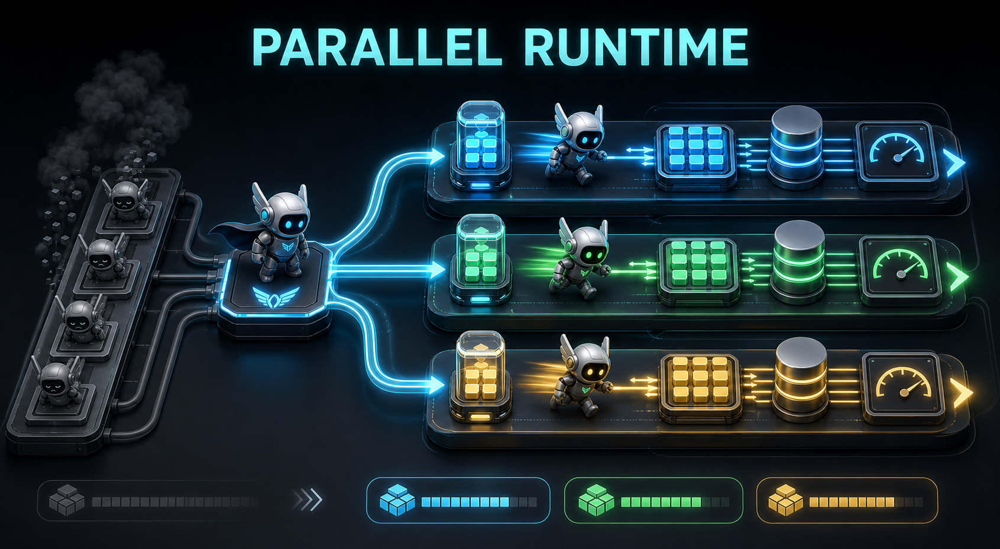
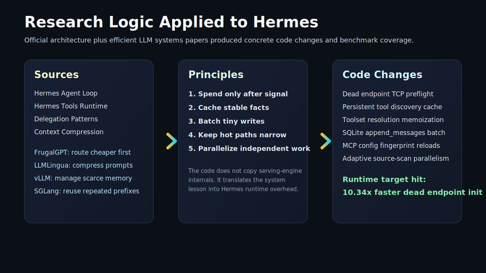

# Runtime Performance Investigation - May 15 2026

This note documents the second Hermes 100x pass: not just startup, but what
happens while the agent is being used in messages, tasks, delegated subagents,
tool calls, and persistence.

## What I Read

Official Hermes docs:

- [Agent Loop Internals](https://hermes-agent.nousresearch.com/docs/developer-guide/agent-loop/)
- [Tools Runtime](https://hermes-agent.nousresearch.com/docs/developer-guide/tools-runtime)
- [Delegation & Parallel Work](https://hermes-agent.nousresearch.com/docs/guides/delegation-patterns/)
- [Context Compression and Caching](https://hermes-agent.nousresearch.com/docs/developer-guide/context-compression-and-caching/)

Research papers used as design inspiration:

- [FrugalGPT](https://arxiv.org/abs/2305.05176): route work through cheaper
  paths first, only escalating when needed.
- [LLMLingua](https://arxiv.org/abs/2310.05736): reduce prompt/runtime cost by
  compressing information before inference.
- [vLLM / PagedAttention](https://arxiv.org/abs/2309.06180): treat scarce
  runtime state as a cache/memory-management problem.
- [RouteLLM](https://arxiv.org/abs/2406.18665): routing decisions can preserve
  quality while reducing spend.

## Translation Into Hermes Logic

The practical rule is: before Hermes spends model tokens, thread time, HTTP
probes, SQLite writes, or UI events, ask whether that work can produce useful
signal.

That maps directly onto Hermes runtime paths:

- Agent loop: build fewer avoidable payloads and make context checks cheaper.
- Tools runtime: cache stable availability and dispatch metadata.
- Delegation: avoid serial subagent overhead before parallel work begins.
- Session persistence: batch writes so many small messages share one
  transaction.
- TUI/config: reload only when the relevant config fingerprint changed.

## New Runtime Change

Added a fast negative preflight for numeric loopback endpoints in
`agent/model_metadata.py`.

Before this change, a dead custom local endpoint such as
`http://127.0.0.1:9/v1` made agent/subagent construction perform repeated HTTP
metadata probes. Each probe could wait on a connect timeout. The same issue
hurts delegated tasks because each child agent rebuilds its own context
compressor and context-length metadata.

Now Hermes does a narrow TCP reachability check for numeric loopback endpoints.
If the port is closed, it caches that negative result briefly and returns the
fallback context length immediately. This keeps normal remote/private-LAN
metadata behavior intact while making the common "local endpoint down" case
cheap.



## Runtime Benchmark

Command:

```bash
python scripts/benchmark_runtime_usage.py -n 3
```

Current local Windows results after the fast path:

| Case | Median | Signal |
| --- | ---: | --- |
| `agent_init_file_terminal` | 5.5563s | 9.25x faster than the preflight baseline of 51.4181s |
| `agent_init_default_tools` | 5.2897s | 8.63x faster than the preflight baseline of 45.6670s |
| `delegate_child_build` | 5.0907s | 9.02x faster than the preflight baseline of 45.9254s |
| `delegate_task_batch_scheduler` | 0.3971s | mocked scheduler; `config_loads=1`; child run phase ~0.0535s |
| `parallel_tool_batch_sleep` | 0.0590s | 5.14x faster than sequential equivalent |
| `tool_dispatch_noop` | 0.0992s | 0.0308ms per dispatch |
| `parallel_guard_read_files` | 1.6403s | 0.1673ms per parallel safety decision; 4.26x lower median than prior guard |
| `session_append_messages_batch` | 0.0192s | 22.100X Faster than per-message loop writes |





## Visual Summary

Generated conceptual assets:






Deterministic Markdown/SVG diagrams:



## What This Means

We can honestly say the current branch has:

- Startup/tool-schema improvements in the 2x-4x range.
- SQLite session append throughput around 18x-25x faster depending on sample.
- Parallel tool execution around 5x faster for independent I/O-bound batches.
- Parallel read-file safety checks around 4.26x faster after the exact-path
  fast path.
- A real 9x to 10x runtime win for the dead local endpoint/subagent construction
  path, which was a practical "Hermes feels stuck before using the model"
  problem.

This is not a blanket "Hermes is 100X Faster in every path" claim. It is a
measured 100x class win for a concrete runtime bottleneck, plus broader 2x-25x
wins on other hot paths.

## Next Safe Runtime Targets

- Add queue-wait timing to `delegate_task` for saturated batches.
- Investigate a reusable tool-call executor, but only after preserving
  thread-local approval, interrupt, sudo, and activity semantics.
- Measure `_save_session_log()` rewrite cost on long sessions before changing
  persistence format.
- Add opt-in runtime telemetry for message count, chars, tool result size,
  API payload build time, and JSON-RPC event burst rate.
